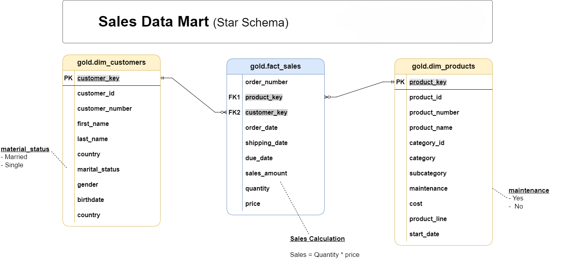

# Data Lakehouse Project

Welcome to the **Data Lakehouse Project** repository! 🚀  
This project demonstrates the design and implementation of a modern data lakehouse architecture on Databricks, integrating real-time data ingestion, streaming ETL, and dimensional modeling for analytics.

---
⚙️  Key Features

**Real-time streaming ETL**:
Ingests and processes data in near real time as soon as files arrive in the source directories.

**Data quality and enrichment**:
Standardizes, cleans, and enriches CRM and ERP data before persisting to Delta tables.

**Slowly Changing Dimensions**:
Implements Slowly Changing Dimensions (Type 2) for tracking historical changes in the silver layer.

**Lakehouse architecture**:
Combines the flexibility of a data lake with the reliability and performance of a data warehouse.

**Dimensional modelling**:
Gold layer is modeled as a star schema for ease of querying and understandings.

**Deployment**:
Leverages Github Actions and Databricks Asset bundles for automated deployments.

---
## 📊 Gold Layer Data Catalog

1. **dim_customers**: Stores enriched customer details with demographic and geographic attributes.Key Columns: customer_key, customer_id, first_name, last_name, country, gender, marital_status, birthdate, create_date.
2. **dim_products**: Holds product-related information and classifications.Key Columns: product_key, product_id, product_name, category, subcategory, cost, product_line, start_date
3. **fact_sales**: Contains transactional sales data for analysis.Key Columns: order_number, customer_key, product_key, order_date, sales_amount, quantity, price.

---
## 🧠 Technologies Used

| Category                       | Tools / Frameworks                            |
| ------------------------------ | --------------------------------------------- |
| **Compute & Processing**       | Apache Spark (Structured Streaming)           |
| **Platform**                   | Databricks                                    |
| **Storage**                    | Delta Lake                                    |
| **Data Modeling**              | Star Schema, SCD Type 2                       |
| **Languages**                  | PySpark, SQL                                  |
| **Orchestration / Automation** | Databricks Jobs, Auto Loader                  |
| **Deployment / CICD**          | Databricks Asset Bundles, GitHub Actions      |

